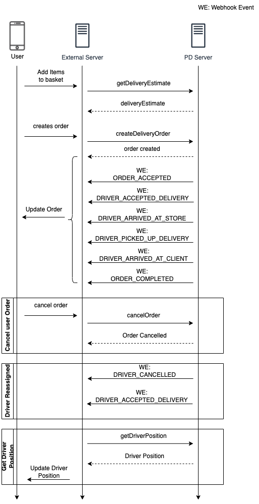

# PideDirecto API
- [Environments](#environments)
- [API Key](#api-key)
- [Store Id](#store-id)
- [Webhook](#webhook)
- [HTTP Status Codes and Errors](#http-status-codes-and-errors)
- [Getting Started](#getting-started)
- [Product API](#product-api)
  - [POST uploadStoreMenu](#post-uploadstoremenu)
  - [POST uploadStoreMenuV2](#post-uploadstoremenuv2)
  - [POST changeProductPrice](#post-changeproductprice)
  - [POST unHideProduct](#post-unhideproduct)
  - [POST hideProduct](#post-hideproduct)
- [Order API](#order-api)
  - [POST acceptOrder](#post-acceptorder)
  - [POST rejectOrder](#post-rejectorder)
  - [POST getDeliveryEstimate](#post-getdeliveryestimate)
  - [POST createDeliveryOrder](#post-createdeliveryorder)
  - [POST cancelOrder](#post-cancelorder)
  - [POST getDriverPosition](#post-getdriverposition)

- [Webhook Events](#webhook-events)
  - [Event Type ORDER_CREATED](#event-type-order_created)
  - [Event Type ORDER_REJECTED](#event-type-order_rejected)
  - [Event Type ORDER_ACCEPTED](#event-type-order_accepted)
  - [Event Type ORDER_CANCELLED](#event-type-order_cancelled)
  - [Event Type DRIVER_ACCEPTED_DELIVERY](#event-type-driver_accepted_delivery)
  - [Event Type DRIVER_ARRIVED_AT_STORE](#event-type-driver_arrived_at_store)
  - [Event Type DRIVER_PICKED_UP_DELIVERY](#event-type-driver_picked_up_delivery)
  - [Event Type DRIVER_ARRIVED_AT_CLIENT](#event-type-driver_arrived_at_client)
  - [Event Type DRIVER_CANCELLED](#event-type-driver_cancelled)
  - [Event Type ORDER_COMPLETED](#event-type-order_completed)
- [Diagrams](#examples)
  - [Diagram Order Creation](#diagram-order-creation)
- [Changelog](#changelog)


## Environments
There is a TEST and a PRODUCTION environment you can use to validate your integration.

You will receive a TEST version of our PideDirecto Drivers App and urls to access the test version PideDirecto Admin in our test environment.
You will need an Android device to be able to test the delivery part.

The PRODUCTION environment can't be tested without the chance of getting real drivers accepting your orders.
If you still would like test in production you could register yourself as a driver and try to accept the deliveries before any other live drivers.

Please contact your Account Manager to get your test account configured and the test version of the PideDirecto Drivers App.


## API Key
You need a Private API Key that you use for accessing our API for all stores.
API Key has to be sent in Header: 'x-api-key'

There is one API Key for the TEST environment and another for PRODUCTION environment.
The API Keys are private and should only be used from server.
If your credentials gets compromised you we can create you a new one and invalidate the old one at any time.

To get an API key, talk to your Account Manager.

#### Example
```
headers: {
  'x-api-key': 'private_test_YAdrs93oY6HBX7Tws34QsLdo'
}
```

## Store Id
Each unique location that needs the delivery service needs to configured in PideDirecto before it can be integrated.
All unique locations has a unique Store Id, a UUID 4 string.
This Store Id has to be provided when creating orders through the API.

Please contact your Account Manager to add new locations or if you need to know what storeId you have configured.


## HTTP Status Codes and Errors
All API endpoints return the following status codes along with the header `"Content-Type": "application/json"`.

| HTTP Status Codes           | Description                                                                                                                                                     |
|-----------------------------|-----------------------------------------------------------------------------------------------------------------------------------------------------------------|
| 200 - OK                    | Successful request                                                                                                                                              |
| 400 - Bad Request           | - Required parameter not sent in request <br/> - Parameter type is not correct in sent request <br/> - Trying to call API when resource state does not allow it |
| 401 - Unauthorized          | - Wrong or no API key is provided in header x-api-key <br> - API Key does not have permission to call api for specific resource                                 |
| 404 - Not Found             | Invalid API endpoint                                                                                                                                            |
| 500 - Internal Server Error | An unknown server error has occurred, try again.                                                                                                                |

<br/>

All errors returned by API returns at least the following

| Body Parameter | Type   | Description                                       |
|----------------|--------|---------------------------------------------------|
| name           | string | A unique name of the error                        |
| message        | string | A readable description about the error in english |

<br/>

Here is a list of unique general errors that be returned in all API endpoints.
Check the documentation for a specific endpoint to see other Error Names specific to that endpoint.

| HTTP Status Codes           | Error Name        | Description                                                                                                                     |
|-----------------------------|-------------------|---------------------------------------------------------------------------------------------------------------------------------|
| 401 - Unauthorized          | UnauthorizedError | - Wrong or no API key is provided in header x-api-key <br> - API Key does not have permission to call api for specific resource |
| 404 - Not Found             | NotFound          | Invalid API endpoint                                                                                                            |
| 500 - Internal Server Error | UnknownError      | An unknown server error has occurred, try again.                                                                                |


## Webhook
To receive order/delivery updates you need to configure a webhook or pass one as a parameter when creating an order through the API.
Please note that if you choose to pass webhooks in the API calls, and do not configure a general webhook, you will not get order/delivery updates about of orders created outside this API.

Webhook has to be configured to accept HTTP POST request.
The webhook endpoint should return a HTTP Status 200 response if update was successfully received.
Else it has to return anything but HTTP Status 200.
We will try to re-post order/delivery updates to the webhook url for maximum 3 times every minute.

To configure a general webhook please contact your account manager and send him your webhook for both the TEST and PRODUCTION environments.


## Getting Started
To test the order/delivery status updates you will need install a test version of
the PideDirecto Drivers App and register as a driver.

Just follow the signup process in the drivers app and when you are done make sure to tell your Account Manager so he can verify the driver registered.
Since you need to be a verified driver to be able to receiver deliveries to deliver.


## Product API


### POST uploadStoreMenu
Use this API method to upload a group of products to a store.

#### Request
| Body Parameter                                                                                                                    | Type                                                                            | Description                                                                                                                                                           |
|-----------------------------------------------------------------------------------------------------------------------------------|---------------------------------------------------------------------------------|-----------------------------------------------------------------------------------------------------------------------------------------------------------------------|
| storeId                                                                                                                           | string (UUID)                                                                   | The Store Id of the store that the menu is going to be added                                                                                                          |
| storeMenu                                                                                                                         | Object                                                                          | Store Menu to be uploaded to store provided                                                                                                                           |
| storeMenu.name                                                                                                                    | string                                                                          | Name of the store menu                                                                                                                                                |
| storeMenu.hours                                                                                                                   | string                                                                          | Hours that should the menu be visible.<br/> E.g. "Mo-Fr 08:00-09:00", "Sa-Su" or "Mar Mo-Fr 11:00-14:00". see https://openingh.openstreetmap.de/evaluation_tool/#check |
| storeMenu.channels                                                                                                                | Array                                                                           | Channels that this menu should be visible for                                                                                                                         |
| storeMenu.channels[i]                                                                                                             | string ( <br/> &nbsp;&nbsp;"PIDEDIRECTO" <br/> &nbsp;&nbsp;"UBER_EATS" <br/> )  | Store channel that this menu should be visible for                                                                                                                    |
| storeMenu.categories                                                                                                              | Array                                                                           | Array of categories that the menu has                                                                                                                                 |
| storeMenu.categories[i]                                                                                                           | Object                                                                          | Store Menu Category Item                                                                                                                                              |
| storeMenu.categories[i].name                                                                                                      | string                                                                          | Name of the category                                                                                                                                                  |
| storeMenu.categories[i].products                                                                                                  | Array                                                                           | Array of Products that this category contains                                                                                                                         |
| storeMenu.categories[i].products[j]                                                                                               | Object                                                                          | A Product Item                                                                                                                                                        |
| storeMenu.categories[i].products[j].externalProductId                                                                             | string &#124; undefined                                                         | External Identifier of this product                                                                                                                                   |
| storeMenu.categories[i].products[j].externalProductData                                                                           | string &#124; undefined                                                         | External additional information of this product                                                                                                                       |
| storeMenu.categories[i].products[j].name                                                                                          | string                                                                          | Name of this product                                                                                                                                                  |
| storeMenu.categories[i].products[j].description                                                                                   | string                                                                          | Description of the product                                                                                                                                            |
| storeMenu.categories[i].products[j].price                                                                                         | string                                                                          | Price of this product                                                                                                                                                 |
| storeMenu.categories[i].products[j].imageUrl                                                                                      | string &#124; undefined                                                         | Url that contains an image of the product                                                                                                                             |
| storeMenu.categories[i].products[j].modifierGroups                                                                                | Array  &#124; undefined                                                         | Array of modifier groups for this product                                                                                                                             |
| storeMenu.categories[i].products[j].modifierGroups[k]                                                                             | Object                                                                          | A modifier group                                                                                                                                                      |
| storeMenu.categories[i].products[j].modifierGroups[k].externalModifierId                                                          | string &#124; undefined                                                         | External Identifier of this modifier group                                                                                                                            |
| storeMenu.categories[i].products[j].modifierGroups[k].name                                                                        | string                                                                          | Name of this modifier group                                                                                                                                           |
| storeMenu.categories[i].products[j].modifierGroups[k].requiredMin                                                                 | number &#124; undefined                                                         | Minimum amount of selections of modifiers in this modifier group                                                                                                      |
| storeMenu.categories[i].products[j].modifierGroups[k].requiredMax                                                                 | number &#124; undefined                                                         | Maximum amount of selections of modifiers in this modifier group                                                                                                      |
| storeMenu.categories[i].products[j].modifierGroups[k].modifiers                                                                   | Array                                                                           | Array of modifiers in this modifier group                                                                                                                             |
| storeMenu.categories[i].products[j].modifierGroups[k].modifiers[l]                                                                | Object                                                                          | A modifier                                                                                                                                                            |
| storeMenu.categories[i].products[j].modifierGroups[k].modifiers[l].externalModifierId                                             | string                                                                          | External Identifier of this modifier, it is also used to map to the corresponding modifier provided                                                                   |
| storeMenu.categories[i].products[j].modifierGroups[k].modifiers[l].overwritePrice                                                 | string &#124; undefined                                                         | Use this field if you want to overwrite the price of the modifier provided                                                                                            |
| storeMenu.categories[i].products[j].modifierGroups[k].modifiers[l].type                                                           | string ( <br/> &nbsp;&nbsp;"SINGLE" <br/> &nbsp;&nbsp;"MULTIPLE" <br/> )        | If customer is allowed to select a quantity more then 1 of the modifier item "MULTIPLE" otherwise "SINGLE"                                                            |
| storeMenu.categories[i].products[j].modifierGroups[k].modifiers[l].subModifierGroups                                              | Array &#124; undefined                                                          | Array of sub-modifier groups for this product                                                                                                                         |
| storeMenu.categories[i].products[j].modifierGroups[k].modifiers[l].subModifierGroups[k]                                           | Object                                                                          | A sub-modifier group                                                                                                                                                  |
| storeMenu.categories[i].products[j].modifierGroups[k].modifiers[l].subModifierGroups[k].externalSubModifierId                     | string &#124; undefined                                                         | External Identifier of this sub-modifier group                                                                                                                        |
| storeMenu.categories[i].products[j].modifierGroups[k].modifiers[l].subModifierGroups[k].name                                      | string                                                                          | Name of this sub-modifier group                                                                                                                                       |
| storeMenu.categories[i].products[j].modifierGroups[k].modifiers[l].subModifierGroups[k].requiredMin                               | number &#124; undefined                                                         | Minimum amount of selections of sub-modifiers in this sub-modifier group                                                                                              |
| storeMenu.categories[i].products[j].modifierGroups[k].modifiers[l].subModifierGroups[k].requiredMax                               | number &#124; undefined                                                         | Maximum amount of selections of sub-modifiers in this sub-modifier group                                                                                              |
| storeMenu.categories[i].products[j].modifierGroups[k].modifiers[l].subModifierGroups[k].subModifiers                              | Array                                                                           | Array of sub-modifiers for this sub-modifier group                                                                                                                    |
| storeMenu.categories[i].products[j].modifierGroups[k].modifiers[l].subModifierGroups[k].subModifiers[l]                           | Object                                                                          | A sub-modifier                                                                                                                                                        |
| storeMenu.categories[i].products[j].modifierGroups[k].modifiers[l].subModifierGroups[k].subModifiers[l].externalSubModifierItemId | string &#124; undefined                                                         | External Identifier of this sub-modifier                                                                                                                              |
| storeMenu.categories[i].products[j].modifierGroups[k].modifiers[l].subModifierGroups[k].subModifiers[l].name                      | string                                                                          | Name of this sub-modifier                                                                                                                                             |
| storeMenu.categories[i].products[j].modifierGroups[k].modifiers[l].subModifierGroups[k].subModifiers[l].price                     | number                                                                          | Price of this sub-modifier                                                                                                                                            |
| storeMenu.categories[i].products[j].modifierGroups[k].modifiers[l].subModifierGroups[k].subModifiers[l].type                      | string ( <br/> &nbsp;&nbsp;"SINGLE" <br/> &nbsp;&nbsp;"MULTIPLE" <br/> )        | If customer is allowed to select a quantity more then 1 of the sub-modifier "MULTIPLE" otherwise "SINGLE"                                                             |
| storeMenu.modifiers                                                                                                               | Array                                                                           | Array of modifiers used in the storeMenu                                                                                                                              |
| storeMenu.modifiers[i]                                                                                                            | Object                                                                          | Modifier Object that can be reused in storeMenu using externalModifierId                                                                                              |
| storeMenu.modifiers[i].externalModifierId                                                                                         | string                                                                          | External identifier of this modifier, this id is also used for identifying the modifier in storeMenu                                                                  |
| storeMenu.modifiers[i].name                                                                                                       | string                                                                          | Name of this modifier                                                                                                                                                 |
| storeMenu.modifiers[i].description                                                                                                | string &#124; undefined                                                         | Description of the modifier                                                                                                                                           |
| storeMenu.modifiers[i].price                                                                                                      | string                                                                          | Price of the modifier                                                                                                                                                 |
| storeMenu.modifiers[i].imageUrl                                                                                                   | string &#124; undefined                                                         | Url that contains an image of the modifier                                                                                                                            |

#### Response Success
Response Status Code 200

| Body Parameter | Type | Description |
|----------------|------|-------------|
| N/A            | N/A  | N/A         |

#### Response Error
Here is a list of unique errors that be returned for this API endpoint.

| HTTP Status Codes           | Error Name           | Description                                                                                                                                                                                      |
|-----------------------------|----------------------|--------------------------------------------------------------------------------------------------------------------------------------------------------------------------------------------------|
| 400 - Bad Request           | InvalidArgumentError | - Required parameter not sent in request <br/> - Parameter type is not correct in sent request <br/> - Product with productId not found <br/> - Neither productId nor externalProductId was sent |
| 429 - Too Many Requests     | ApiCallLimitExceeded | Occurs in case uploadStoreMenu API is called more than twice within 2 minutes                                                                                                                   |
| 500 - Internal Server Error | UnknownError         | An unknown server error has occurred, try again.                                                                                                                                                 |

#### Example
Request:

```json
{
  "storeId": "4b825ef7-f4ac-42ec-b1bb-8eb662ef7acb",
  "storeMenu": {
    "name": "PideDirecto Menu",
    "hours": "Mo-Fr 08:00-09:00",
    "channels": [
      "PideDirecto"
    ],
    "categories": [
      {
        "name": "Burgers",
        "products": [
          {
            "externalProductId": "Burguer01",
            "name": "Cheeseburger",
            "description": "Burguer with cheese",
            "price": "100",
            "imageUrl": "http://routeToImage.com",
            "modifierGroups": [
              {
                "externalModifierGroupId": "SidersGroup01",
                "name": "Siders",
                "requiredMin": 0,
                "requiredMax": 1,
                "modifiers": [
                  {
                    "externalModifierId": "SiderModifier01",
                    "overwritePrice": "10",
                    "type": "SINGLE",
                    "subModifierGroups": [
                      {
                        "externalSubModifierGroupId": "SubModifierGroup01",
                        "name": "Extra Sauce",
                        "requiredMin": 0,
                        "requiredMax": 1,
                        "subModifiers": [
                          {
                            "externalSubModifierId": "Cheese01",
                            "name": "Extra Cheese for Fries",
                            "price": "10",
                            "type": "SINGLE"
                          }
                        ]
                      }
                    ]
                  }
                ]
              }
            ]
          }
        ]
      }
    ],
    "modifiers": [
      {
        "externalModifierId": "SiderModifier01",
        "name": "Fries",
        "description": "Extra fries for burguer",
        "price": "50",
        "imageUrl": "http://routeToImage.com"
      }
    ]
  }
}


```
### POST uploadStoreMenuV2
Use this API method to upload a group of products to a store.

#### Request
| Body Parameter                                      | Type                                                                                                                                                                                                             | Description                                                                                                                                                               |
|-----------------------------------------------------|------------------------------------------------------------------------------------------------------------------------------------------------------------------------------------------------------------------|---------------------------------------------------------------------------------------------------------------------------------------------------------------------------|
| storeId                                             | string (UUID)                                                                                                                                                                                                    | The Store Id of the store that the menu is going to be added                                                                                                              |
| storeMenu                                           | Object                                                                                                                                                                                                           | Store Menu to be uploaded to store provided                                                                                                                               |
| storeMenu.menu                                      | Object                                                                                                                                                                                                           | The menu to upload                                                                                                                                                        |
| storeMenu.menu.menuId                               | string                                                                                                                                                                                                           | The id to reference the menu in your domain                                                                                                                               |
| storeMenu.menu.name                                 | string                                                                                                                                                                                                           | Name of the menu                                                                                                                                                          |
| storeMenu.menu.hours                                | string &#124; undefined                                                                                                                                                                                          | Hours that should the menu be visible.<br/> E.g. "Mo-Fr 08:00-09:00", "Sa-Su" or "Mar Mo-Fr 11:00-14:00". see https://openingh.openstreetmap.de/evaluation_tool/#check    |
| storeMenu.menu.channels                             | Array  &#124; undefined                                                                                                                                                                                          | Channels that this menu should be visible for                                                                                                                             |
| storeMenu.menu.channels[i]                          | string ( <br/> &nbsp;&nbsp;"PIDEDIRECTO" <br/> &nbsp;&nbsp;"UBER_EATS" <br/> )                                                                                                                                   | Store channel that this menu should be visible for                                                                                                                        |
| storeMenu.menu.hidden                               | boolean                                                                                                                                                                                                          | Boolean indicating if the menu is hidden                                                                                                                                  | 
| storeMenu.menu.categoryIds                          | Array                                                                                                                                                                                                            | Array that contains the ids of the categories that belongs to the menu                                                                                                    | 
| storeMenu.menu.categoryIds[i]                       | string                                                                                                                                                                                                           | The categoryId should reference a category included in storeMenu.categories                                                                                               |
| storeMenu.categories                                | Array                                                                                                                                                                                                            | Array that contains the collection of categories to upload                                                                                                                |
| storeMenu.categories[i].categoryId                  | string                                                                                                                                                                                                           | The id to reference the category in your domain                                                                                                                           |
| storeMenu.categories[i].name                        | string                                                                                                                                                                                                           | Name of the category                                                                                                                                                      |
| storeMenu.categories[i].hidden                      | boolean                                                                                                                                                                                                          | Boolean indicating if the category is hidden                                                                                                                              |
| storeMenu.categories[i].imageUrl                    | string  &#124; undefined                                                                                                                                                                                         | Url that contains an image of the category                                                                                                                                |
| storeMenu.categories[i].productIds                  | Array                                                                                                                                                                                                            | Array that contains the ids of the product that belongs to the category                                                                                                   |
| storeMenu.categories[i].productIds[i]               | string                                                                                                                                                                                                           | The productId should reference a products included in storeMenu.products                                                                                                  |
| storeMenu.products                                  | Array                                                                                                                                                                                                            | Array that contains the collection of product to upload                                                                                                                   |
| storeMenu.products[i].productId                     | string                                                                                                                                                                                                           | The id to reference the product in your domain                                                                                                                            |
| storeMenu.products[i].productData                   | string &#124; undefined                                                                                                                                                                                          | External additional information for this product                                                                                                                          |
| storeMenu.products[i].size                          | string (<br/> &nbsp;&nbsp;"XX_SMALL" <br/> &nbsp;&nbsp;"X_SMALL" <br/> &nbsp;&nbsp;"SMALL" <br/> &nbsp;&nbsp;"MEDIUM" <br/> &nbsp;&nbsp;"LARGE" <br/> &nbsp;&nbsp;"X_LARGE" <br/> &nbsp;&nbsp;"XX_LARGE" <br/> ) | Size of the product                                                                                                                                                       |
| storeMenu.products[i].menuItemType                  | string ( <br/> &nbsp;&nbsp;"ITEM" <br/> &nbsp;&nbsp;"MODIFIER" <br/> )                                                                                                                                           | Type of the product                                                                                                                                                       |
| storeMenu.products[i].isModifier                    | boolean &#124; undefined                                                                                                                                                                                         | Boolean indicating if the product is a modifier                                                                                                                           |
| storeMenu.products[i].isProduct                     | boolean &#124; undefined                                                                                                                                                                                         | Boolean indicating if the product is a product                                                                                                                            |                                                                                                                                                                         
| storeMenu.products[i].name                          | string                                                                                                                                                                                                           | Name of the product                                                                                                                                                       |                                                                                                                                                                                                                                                            
| storeMenu.products[i].description                   | string &#124; undefined                                                                                                                                                                                          | Description of the product                                                                                                                                                |
| storeMenu.products[i].hours                         | string &#124; undefined                                                                                                                                                                                          | Hours that should the product be visible.<br/> E.g. "Mo-Fr 08:00-09:00", "Sa-Su" or "Mar Mo-Fr 11:00-14:00". see https://openingh.openstreetmap.de/evaluation_tool/#check |
| storeMenu.products[i].price                         | string                                                                                                                                                                                                           | Price of this product                                                                                                                                                     |
| storeMenu.products[i].promoPrice                    | string &#124; undefined                                                                                                                                                                                          | PromoPrice of this product                                                                                                                                                |
| storeMenu.products[i].promoText                     | string &#124; undefined                                                                                                                                                                                          | Description of the promotion for the product                                                                                                                              |
| storeMenu.products[i].imageUrl                      | string &#124; undefined                                                                                                                                                                                          | Url that contains an image of the product                                                                                                                                 |
| storeMenu.products[i].hidden                        | string                                                                                                                                                                                                           | Boolean indicating if the product is a hidden                                                                                                                             |
| storeMenu.products[i].hiddenUntil                   | Date &#124; undefined                                                                                                                                                                                            | The Date until the product will be hidden                                                                                                                                 |
| storeMenu.products[i].modifierGroupIds              | Array                                                                                                                                                                                                            | Array that contains the ids of the modifier groups that belongs to the product                                                                                            |
| storeMenu.products[i].modifierGroupIds[i]           | string                                                                                                                                                                                                           | The modifierGroupId should reference a modifier group included in storeMenu.modifierGroups                                                                                |
| storeMenu.modifierGroups                            | Array                                                                                                                                                                                                            | Array that contains the collection of modifier groups to upload                                                                                                           |
| storeMenu.modifierGroups[i].modifierGroupId         | string                                                                                                                                                                                                           | The id to reference the modifier group in your domain                                                                                                                     |
| storeMenu.modifierGroups[i].name                    | string                                                                                                                                                                                                           | Name of the modifier group                                                                                                                                                |
| storeMenu.modifierGroups[i].requiredMin             | number &#124; undefined                                                                                                                                                                                          | Minimum amount of selections of modifiers in this modifier group                                                                                                          |
| storeMenu.modifierGroups[i].requiredMax             | number &#124; undefined                                                                                                                                                                                          | Maximum amount of selections of modifiers in this modifier group                                                                                                          |
| storeMenu.modifierGroups[i].hidden                  | boolean                                                                                                                                                                                                          | Boolean indicating if the modifier group is a hidden                                                                                                                      |
| storeMenu.modifierGroups[i].modifiers               | Array                                                                                                                                                                                                            | Array that contains the collection of modifiers in the modifier group                                                                                                     |
| storeMenu.modifierGroups[i].modifiers[i].modifierId | string                                                                                                                                                                                                           | The id to reference the modifier in your domain                                                                                                                           |
| storeMenu.modifierGroups[i].modifiers[i].name       | string  &#124; undefined                                                                                                                                                                                         | Name of the modifier, this will overwrite the product value                                                                                                               |
| storeMenu.modifierGroups[i].modifiers[i].hidden     | boolean &#124; undefined                                                                                                                                                                                         | Boolean indicating if the modifier  is a hidden, this will overwrite the product value                                                                                    |
| storeMenu.modifierGroups[i].modifiers[i].price      | string  &#124; undefined                                                                                                                                                                                         | Price of the modifier, this will overwrite the product value                                                                                                              |
| storeMenu.modifierGroups[i].modifiers[i].type       | string ( <br/> &nbsp;&nbsp;"SINGLE" <br/> &nbsp;&nbsp;"MULTIPLE" <br/> )                                                                                                                                         | Type of the modifier                                                                                                                                                      |


#### Response Success
Response Status Code 200

| Body Parameter | Type | Description |
|----------------|------|-------------|
| N/A            | N/A  | N/A         |

#### Response Error
Here is a list of unique errors that be returned for this API endpoint.

| HTTP Status Codes           | Error Name           | Description                                                                                                                                                                                       |
|-----------------------------|----------------------|---------------------------------------------------------------------------------------------------------------------------------------------------------------------------------------------------|
| 400 - Bad Request           | InvalidArgumentError | - Required parameter not sent in request <br/> - Parameter type is not correct in sent request <br/> - Product with productId not found <br/> - Neither productId nor externalProductId was sent  |
| 429 - Too Many Requests     | ApiCallLimitExceeded | Occurs in case uploadStoreMenu API is called more than twice within 2 minutes                                                                                                                     |
| 500 - Internal Server Error | UnknownError         | An unknown server error has occurred, try again.                                                                                                                                                  |

#### Example
Request:

```json
{
  "storeId":"1d291d1c-1ecd-4c2e-a7f4-fabc1fac93f7",
  "storeMenu":{
    "menu":{
      "menuId":"menuId01",
      "name":"menu1",
      "hidden":false,
      "channels":[
        "DIDI_FOOD",
        "PIDEDIRECTO"
      ],
      "categoryIds":[
        "categoryId01"
      ]
    },
    "categories":[
      {
        "categoryId":"categoryId01",
        "name":"category01",
        "hidden":false,
        "productIds":[
          "productId01"
        ]
      }
    ],
    "products":[
      {
        "productId":"productId01",
        "size":"LARGE",
        "menuItemType":"MODIFIER",
        "name":"product01",
        "price":"10",
        "hidden":false,
        "modifierGroupIds":[

        ]
      },
      {
        "productId":"productId02",
        "size":"LARGE",
        "menuItemType":"ITEM",
        "name":"product02",
        "price":"100",
        "hidden":false,
        "modifierGroupIds":[
          "modifierGroupId01"
        ]
      }
    ],
    "modifierGroups":[
      {
        "modifierGroupId":"modifierGroupId01",
        "name":"modifierGroup01",
        "requiredMin":0,
        "requiredMax":1,
        "hidden":false,
        "modifiers":[
          {
            "modifierId":"productId01",
            "hidden":false,
            "name":"product01",
            "price":"10",
            "type":"SINGLE"
          }
        ]
      }
    ]
  }
}
```

### POST changeProductPrice
Use this API method to change the product price.

#### Request

| Body Parameter    | Type            | Description                                                                                                          |
|-------------------|-----------------|----------------------------------------------------------------------------------------------------------------------|
| productId         | string (UUID)   | - The Product Id you want to change <br/> - Not required if you send only a externalProductId                        |
| externalProductId | string          | - The external product id you configured previously in the product <br/> - It is ignored if you send a productId too |
| price             | string (number) | The new product price                                                                                                |

#### Response Success
Response Status Code 200

| Body Parameter | Type | Description |
|----------------|------|-------------|
| N/A            | N/A  | N/A         |

#### Response Error
Here is a list of unique errors that be returned for this API endpoint.

| HTTP Status Codes           | Error Name           | Description                                                                                                                                                                                      |
|-----------------------------|----------------------|--------------------------------------------------------------------------------------------------------------------------------------------------------------------------------------------------|
| 400 - Bad Request           | InvalidArgumentError | - Required parameter not sent in request <br/> - Parameter type is not correct in sent request <br/> - Product with productId not found <br/> - Neither productId nor externalProductId was sent |
| 500 - Internal Server Error | UnknownError         | An unknown server error has occurred, try again.                                                                                                                                                 |

#### Example
Request:
```json
{
  "productId": "45d13207-0db5-3d01-c26d-be06cd50188a",
  "price": "99.99"
}
```

### POST unHideProduct
Use this API method to change the product visibility.

#### Request

| Body Parameter    | Type            | Description                                                        |
|-------------------|-----------------|--------------------------------------------------------------------|
| storeId           | string (UUID)   | - The store id of the product                                      |
| externalProductId | string (UUID)   | - The external product id you configured previously in the product |

#### Response Success
Response Status Code 200

| Body Parameter | Type | Description |
|----------------|------|-------------|
| N/A            | N/A  | N/A         |

#### Response Error
Here is a list of unique errors that be returned for this API endpoint.

| HTTP Status Codes           | Error Name           | Description                                                                                                                                                                                      |
|-----------------------------|----------------------|--------------------------------------------------------------------------------------------------------------------------------------------------------------------------------------------------|
| 400 - Bad Request           | InvalidArgumentError | - Required parameter not sent in request <br/> - Parameter type is not correct in sent request <br/> - Product with productId not found <br/> - Neither productId nor externalProductId was sent |
| 500 - Internal Server Error | UnknownError         | An unknown server error has occurred, try again.                                                                                                                                                 |

#### Example
Request:

```json
{
  "storeId": "4b825ef7-f4ac-42ec-b1bb-8eb662ef7acb",
  "externalProductId": "45d13207-0db5-3d01-c26d-be06cd50188a"
}
```
### POST hideProduct
Use this API method to change the product visibility.

#### Request

| Body Parameter    | Type                             | Description                                                        |
|-------------------|----------------------------------|--------------------------------------------------------------------|
| storeId           | string (UUID)                    | - The store id of the product                                      |
| externalProductId | string (UUID)                    | - The external product id you configured previously in the product |
| hiddenUntil       | string (Date) &#124; undefined   | - Time until the product should be hidden                          |

#### Response Success
Response Status Code 200

| Body Parameter | Type | Description |
|----------------|------|-------------|
| N/A            | N/A  | N/A         |

#### Response Error
Here is a list of unique errors that be returned for this API endpoint.

| HTTP Status Codes           | Error Name           | Description                                                                                                                                                                                      |
|-----------------------------|----------------------|--------------------------------------------------------------------------------------------------------------------------------------------------------------------------------------------------|
| 400 - Bad Request           | InvalidArgumentError | - Required parameter not sent in request <br/> - Parameter type is not correct in sent request <br/> - Product with productId not found <br/> - Neither productId nor externalProductId was sent |
| 500 - Internal Server Error | UnknownError         | An unknown server error has occurred, try again.                                                                                                                                                 |

#### Example
Request:

```json
{
  "storeId": "4b825ef7-f4ac-42ec-b1bb-8eb662ef7acb",
  "externalProductId": "45d13207-0db5-3d01-c26d-be06cd50188a",
  "hiddenUntil": "2023-10-05T14:00:00Z"
}
```


## Order API


### POST acceptOrder
Use this API method to accept an order that was ordered from PideDirecto webpage or app.
Orders can only be accepted as long as the customer did not cancel the order (as long as order status is NEW).
If store cannot accept an order it has to be rejected, see [POST rejectOrder](#POST rejectOrder) api call.

#### Request

| Body Parameter | Type   | Description                                   |
|----------------|--------|-----------------------------------------------|
| orderId        | string | Unique identifier of the order in PideDirecto |

#### Response Success
Response Status Code 200

| Body Parameter | Type | Description |
|----------------|------|-------------|
| N/A            | N/A  | N/A         |


#### Response Error
Here is a list of unique errors that be returned for this API endpoint.

| HTTP Status Codes           | Error Name                 | Description                                                                                    |
|-----------------------------|----------------------------|------------------------------------------------------------------------------------------------|
| 400 - Bad Request           | InvalidArgumentError       | - Required parameter not sent in request <br/> - Parameter type is not correct in sent request |
| 400 - Bad Request           | OrderCannotBeAcceptedError | Order cannot be accepted since current order state does not allow it                           |
| 500 - Internal Server Error | UnknownError               | An unknown server error has occurred, try again.                                               |


#### Example
Request:
```json
{
  "orderId": "37d13197-0fa5-4d0b-85ad-ae06dd40177a"
}
```


### POST rejectOrder
Use this API method to reject an order that was ordered from PideDirecto webpage or app.
Orders can only be rejected as long as the customer did not reject the order (as long as order status is NEW).
If store cannot reject an order it has to be accepted, see [POST rejectOrder](#POST rejectOrder) api call.

#### Request

| Body Parameter | Type                                                                                                                                                                                                                                                                                                                                                                                                                                                                                                  | Description                                   |
|----------------|-------------------------------------------------------------------------------------------------------------------------------------------------------------------------------------------------------------------------------------------------------------------------------------------------------------------------------------------------------------------------------------------------------------------------------------------------------------------------------------------------------|-----------------------------------------------|
| orderId        | string                                                                                                                                                                                                                                                                                                                                                                                                                                                                                                | Unique identifier of the order in PideDirecto |
| reason         | string ( <br/> &nbsp;&nbsp;"CLOSING_SOON" <br/> &nbsp;&nbsp;"PROBLEM_IN_RESTAURANT" <br/> &nbsp;&nbsp;"SOLD_OUT" <br/> &nbsp;&nbsp;"INCORRECT_PRICE" <br/> &nbsp;&nbsp;"DRIVER_NOT_FOUND" <br/> &nbsp;&nbsp;"REJECTED_BY_ADMIN" <br/> &nbsp;&nbsp;"EXTERNAL_COURIER_CANCEL" <br/>  &nbsp;&nbsp;"UNASSIGNED_COURIER" <br/>  &nbsp;&nbsp;"CANCELLED_BY_CLIENT_DUE_TO_WAITING_TIME" <br/>   &nbsp;&nbsp;"CANCELLED_DUE_TO_CLIENT_ERROR" <br/>   &nbsp;&nbsp;"CANCELLED_BY_LACK_OF_CLIENT_CONTACT" <br/>) | Reason why the order is rejected              |

#### Response Success
Response Status Code 200

| Body Parameter | Type | Description |
|----------------|------|-------------|
| N/A            | N/A  | N/A         |


#### Response Error
Here is a list of unique errors that be returned for this API endpoint.

| HTTP Status Codes           | Error Name              | Description                                                                                    |
|-----------------------------|-------------------------|------------------------------------------------------------------------------------------------|
| 400 - Bad Request           | InvalidArgumentError    | - Required parameter not sent in request <br/> - Parameter type is not correct in sent request |
| 400 - Bad Request           | OrderCannotBeCancelled  | Order cannot be rejected since current order state does not allow it                           |
| 500 - Internal Server Error | UnknownError            | An unknown server error has occurred, try again.                                               |


#### Example
Request:
```json
{
  "orderId": "37d13197-0fa5-4d0b-85ad-ae06dd40177a"
}
```


### POST getDeliveryEstimate
If you want to create a delivery order you can use this API method to get a delivery estimate with driving duration or delivery cost before creating the order with [createDeliveryOrder](#POST createDeliveryOrder) API method.
Then pass the `deliveryEstimateId` when calling the [createDeliveryOrder](#POST createDeliveryOrder) API method to create an order with the guaranteed the delivery cost.
If you don't care about the driving duration or a guaranteed delivery cost you can skip calling this API and call [createDeliveryOrder](#POST createDeliveryOrder) without passing a `deliveryEstimateId`.

#### Request
| Body Parameter       | Type          | Description                                             |
|----------------------|---------------|---------------------------------------------------------|
| storeId              | string (UUID) | The Store Id for the store that is sending the delivery |
| deliveryLocation     | Object        | GPS coordinates of the delivery location                |
| deliveryLocation.lat | number        | Latitude GPS coordinate                                 |
| deliveryLocation.lng | number        | Longitude GPS coordinate                                |


#### Response Success
Response Status Code 200

| Body Parameter                 | Type                                                                                                                 | Description                                                                                                                                         |
|--------------------------------|----------------------------------------------------------------------------------------------------------------------|-----------------------------------------------------------------------------------------------------------------------------------------------------|
| deliveryEstimateId             | string (UUID)                                                                                                        | Unique identifier of the delivery estimate created, pass this to [createDeliveryOrder](#POST createDeliveryOrder) to get a guaranteed delivery cost |
| storeLocation                  | Object                                                                                                               | GPS coordinates of the store                                                                                                                        |
| storeLocation.lat              | number                                                                                                               | Latitude GPS coordinate                                                                                                                             |
| storeLocation.lng              | number                                                                                                               | Longitude GPS coordinate                                                                                                                            |
| deliveryLocation               | Object                                                                                                               | GPS coordinates of the delivery location                                                                                                            |
| deliveryLocation.lat           | number                                                                                                               | Latitude GPS coordinate                                                                                                                             |
| deliveryLocation.lng           | number                                                                                                               | Longitude GPS coordinate                                                                                                                            |
| drivingDistance                | number                                                                                                               | Driving Distance in meter calculated using Google Maps                                                                                              |
| drivingDuration                | number                                                                                                               | Driving Duration in seconds calculated using Google Maps                                                                                            |
| deliveryCost                   | string (number)                                                                                                      | Delivery Cost calculated                                                                                                                            |
| deliveryAvailable              | boolean                                                                                                              | Boolean that indicates if PideDirecto is able to make the delivery   (isWithinDeliveryRadius new field)                                             |
| deliveryNotAvailableReason     | string ( <br/> &nbsp;&nbsp;"NOT_WITHIN_DELIVERY_RADIUS"<br/> &nbsp;&nbsp; "DRIVERS_SHORTAGE"<br/> &nbsp;&nbsp;  )    | String that indicates why the delivery is not available                                                                                             |

#### Response Error
Here is a list of unique errors that be returned for this API endpoint.

| HTTP Status Codes           | Error Name           | Description                                                                                    |
|-----------------------------|----------------------|------------------------------------------------------------------------------------------------|
| 400 - Bad Request           | InvalidArgumentError | - Required parameter not sent in request <br/> - Parameter type is not correct in sent request |
| 500 - Internal Server Error | UnknownError         | An unknown server error has occurred, try again.                                               |


### POST createDeliveryOrder
Use this API method to request a delivery.  
Make sure to call [getDeliveryEstimate](#POST getDeliveryEstimate) in advance if you wish to confirm the delivery cost with your customer before creating the order.
Then when creating order pass the `deliveryEstimateId`.
If you have a fixed agreed delivery cost you can omit calling [getDeliveryEstimate](#POST getDeliveryEstimate) and skip passing any `deliveryEstimateId`.

#### Request
| Body Parameter               | Type                                                               | Description                                                                                                                                                                                                                                        |
|------------------------------|--------------------------------------------------------------------|----------------------------------------------------------------------------------------------------------------------------------------------------------------------------------------------------------------------------------------------------|
| storeId                      | string (UUID)                                                      | The Store Id for the store that is sending the delivery                                                                                                                                                                                            |
| deliveryEstimateId           | string (UUID) &#124; undefined                                     | Delivery Estimate Id received from [getDeliveryEstimate](#POST getDeliveryEstimate) API method, pass this if you need to know the delivery cost in advance. If not passed you will not know the delivery cost in advance before creating the order |
| customerName                 | string                                                             | Name of the customer                                                                                                                                                                                                                               |
| customerPhoneNumber          | string                                                             | Phone number to the customer                                                                                                                                                                                                                       |
| customerAddress              | Object                                                             | The delivery address                                                                                                                                                                                                                               |
| customerAddress.location     | Object                                                             | GPS coordinates of the delivery address                                                                                                                                                                                                            |
| customerAddress.location.lat | number                                                             | Latitude GPS coordinate                                                                                                                                                                                                                            |
| customerAddress.location.lng | number                                                             | Longitude GPS coordinate                                                                                                                                                                                                                           |
| customerAddress.street       | string                                                             | Street name and number of the delivery address  &#124; You can include the full address retrieved by Google and leave empty neighborhood, zipCode, city, state and country                                                                         |
| customerAddress.neighborhood | string &#124; undefined                                            | Neighborhood name of the delivery address                                                                                                                                                                                                          |
| customerAddress.zipCode      | string &#124; undefined                                            | ZipCode of the delivery address                                                                                                                                                                                                                    |
| customerAddress.city         | string &#124; undefined                                            | City of the delivery address                                                                                                                                                                                                                       |
| customerAddress.state        | string &#124; undefined                                            | State of the delivery address                                                                                                                                                                                                                      |
| customerAddress.country      | string &#124; undefined                                            | Country of the delivery address                                                                                                                                                                                                                    |
| customerAddress.instructions | string &#124; undefined                                            | Other delivery instruction of the delivery address                                                                                                                                                                                                 |
| paymentMethod                | string ( <br/> &nbsp;&nbsp;"CARD" <br/> &nbsp;&nbsp;"CASH" <br/> ) | The payment method of the delivery address. Can be either "CARD" or "CASH". If "CARD" the driver will not charge customer anything.                                                                                                                |
| orderCost                    | string (number)                                                    | The cost of the order.                                                                                                                                                                                                                             |
| pickupTime                   | string (Date) &#124; undefined                                     | Time the driver can pickup the order at earliest. This parameter can be omitted if you want the driver to pickup order ASAP.                                                                                                                       |
| driverInstructions           | string &#124; undefined                                            | Pickup instructions to show the driver                                                                                                                                                                                                             |
| askDriverForOrderPhoto       | boolean &#124; undefined                                           | Ask driver to take a photo of the order (NOT YET IMPLEMENTED)                                                                                                                                                                                      |
| askDriverForSurvey           | boolean &#124; undefined                                           | Ask driver to complete a survey after delivering the order (NOT YET IMPLEMENTED)                                                                                                                                                                   |
| externalOrderId              | string &#124; undefined                                            | An external order id that can be used outside PideDirecto to identify the order in the integrating system                                                                                                                                          |
| webhookUrl                   | string (URL) &#124; undefined                                      | An webhookUrl that will be used to send order/delivery updates to. If not provided the configured general webhookUrl will be used. If none is configured no webhook will be called.                                                                |
| webhookHeaders               | Object &#124; undefined                                            | An object containing headers to add to the webhook request. Where object field is the header name and field value is the header value to send.                                                                                                     |
| isBigOrder                   | boolean &#124; undefined                                           | Indicate that is a big order.                                                                                                                                                                                                                      |


#### Response Success
Response Status Code 200

| Body Parameter | Type            | Description                                               |
|----------------|-----------------|-----------------------------------------------------------|
| orderId        | string (UUID)   | Unique identifier of the order in PideDirecto             |
| trackingUrl    | string          | A URL for tracking the delivery inside PideDirecto system |
| deliveryCost   | string (number) | The cost of the delivery                                  |

#### Response Error
Here is a list of unique errors that be returned for this API endpoint.

| HTTP Status Codes           | Error Name              | Description                                                                                                          |
|-----------------------------|-------------------------|----------------------------------------------------------------------------------------------------------------------|
| 400 - Bad Request           | InvalidArgumentError    | - Required parameter not sent in request <br/> - Parameter type is not correct in sent request                       |
| 400 - Bad Request           | NotWithinDeliveryRadius | - The delivery is not within the delivery radius of the store. <br/> - Check delivery estimate before creating order |
| 500 - Internal Server Error | UnknownError            | An unknown server error has occurred, try again.                                                                     |


#### Example
Request:

```json
{
  "storeId": "38981f83-853c-4193-a3c2-97f05582e0ad",
  "customerName": "John Doe",
  "customerPhoneNumber": "+521550000000",
  "customerAddress": {
    "location": {
      "lat": 25.5372793,
      "lng": -103.4551457
    },
    "street": "Rio Mississippi 250, Del Valle, 66220 Monterrey, Nuevo Leon",
    "instructions": "Leave it at outside the door"
  },
  "paymentMethod": "CASH",
  "orderCost": "100.50",
  "pickupTime": null,
  "driverInstructions": "Make sure the ice does not melt!",
  "askDriverForOrderPhoto": false,
  "askDriverForSurvey": false,
  "externalOrderId": "id-283789500217743",
  "webhookUrl": null
}
```
Response
```json
{
  "orderId": "37d13197-0fa5-4d0b-85ad-ae06dd40177a",
  "deliveryCost": "31",
  "trackingUrl": "https://tktsixcentenario.test.pidedirecto.mx/paymentlink/7TLvvnVAWoNwFKVJNfzFaL"
}
```


### POST cancelOrder
Use this API method to cancel an order. Orders can only be cancelled if no driver has accepted the order.
As soon as a driver has accepted the order or order is already cancelled/rejected/completed/delivered an error with name `OrderCannotBeCancelled` will be returned.

#### Request

| Body Parameter | Type                                                                                                                                                                                                                                                                                                                                                                                                                                                                                                  | Description                                   |
|----------------|-------------------------------------------------------------------------------------------------------------------------------------------------------------------------------------------------------------------------------------------------------------------------------------------------------------------------------------------------------------------------------------------------------------------------------------------------------------------------------------------------------|-----------------------------------------------|
| orderId        | string                                                                                                                                                                                                                                                                                                                                                                                                                                                                                                | Unique identifier of the order in PideDirecto |
| reason         | string ( <br/> &nbsp;&nbsp;"CLOSING_SOON" <br/> &nbsp;&nbsp;"PROBLEM_IN_RESTAURANT" <br/> &nbsp;&nbsp;"SOLD_OUT" <br/> &nbsp;&nbsp;"INCORRECT_PRICE" <br/> &nbsp;&nbsp;"DRIVER_NOT_FOUND" <br/> &nbsp;&nbsp;"REJECTED_BY_ADMIN" <br/> &nbsp;&nbsp;"EXTERNAL_COURIER_CANCEL" <br/>  &nbsp;&nbsp;"UNASSIGNED_COURIER" <br/>  &nbsp;&nbsp;"CANCELLED_BY_CLIENT_DUE_TO_WAITING_TIME" <br/>   &nbsp;&nbsp;"CANCELLED_DUE_TO_CLIENT_ERROR" <br/>   &nbsp;&nbsp;"CANCELLED_BY_LACK_OF_CLIENT_CONTACT" <br/>) | Reason why the order is cancelled             |

#### Response Success
Response Status Code 200

| Body Parameter | Type | Description |
|----------------|------|-------------|
| N/A            | N/A  | N/A         |


#### Response Error
Here is a list of unique errors that be returned for this API endpoint.

| HTTP Status Codes           | Error Name             | Description                                                                                    |
|-----------------------------|------------------------|------------------------------------------------------------------------------------------------|
| 400 - Bad Request           | InvalidArgumentError   | - Required parameter not sent in request <br/> - Parameter type is not correct in sent request |
| 400 - Bad Request           | OrderCannotBeCancelled | Order cannot be cancelled since current order state does not allow it                          |
| 500 - Internal Server Error | UnknownError           | An unknown server error has occurred, try again.                                               |


#### Example
Request:
```json
{
  "orderId": "37d13197-0fa5-4d0b-85ad-ae06dd40177a",
  "reason": "CLOSING_SOON"
}
```

### POST getDriverPosition
Use this API method to retrieve the driver position of the requested orderId.
Make sure that the orderId exists, and it is not finished.

#### Request
| Body Parameter | Type          | Description                                   |
|----------------|---------------|-----------------------------------------------|
| orderId        | string (UUID) | Unique identifier of the order in PideDirecto |


#### Response Success
Response Status Code 200

| Body Parameter     | Type          | Description                                    |
|--------------------|---------------|------------------------------------------------|
| driverId           | string (UUID) | Unique identifier of the driver in PideDirecto |
| driverPosition     | Object        | Object containing driver position              |
| driverPosition.lat | number        | Latitude GPS coordinate                        |
| driverPosition.lng | number        | Longitude GPS coordinate                       |

#### Response Error
Here is a list of unique errors that be returned for this API endpoint.

| HTTP Status Codes           | Error Name           | Description                                                                                    |
|-----------------------------|----------------------|------------------------------------------------------------------------------------------------|
| 400 - Bad Request           | InvalidArgumentError | - Required parameter not sent in request <br/> - Parameter type is not correct in sent request |
| 500 - Internal Server Error | UnknownError         | An unknown server error has occurred, try again.                                               |


#### Example
Request:

```json
{
  "orderId": "38981f83-853c-4193-a3c2-97f05582e0ad"
}
```
Response

```json
{
  "driverId": "37d13197-0fa5-4d0b-85ad-ae06dd40177a",
  "driverPosition": {
    "lat": 120.87123,
    "lng": 125.81233
  }
}
```


## Webhook Events

### Event Type ORDER_CREATED
This event is will be emitted when a new order is created.

| Body Parameter                                                                                          | Type                                                                                     | Description                                                                                                                                                                                                                                                                                                                 |
|---------------------------------------------------------------------------------------------------------|------------------------------------------------------------------------------------------|-----------------------------------------------------------------------------------------------------------------------------------------------------------------------------------------------------------------------------------------------------------------------------------------------------------------------------|
| orderId                                                                                                 | string (UUID)                                                                            | Unique identifier of the order in pidedirecto                                                                                                                                                                                                                                                                               |
| app                                                                                                     | string (<br/>"PIDEDIRECTO", <br/>"UBER_EATS", <br/>"RAPPI",<br/> "DIDI_FOOD"<br/>)       | Name of the App where the order was created                                                                                                                                                                                                                                                                                 |
| storeId                                                                                                 | string (UUID)                                                                            | The Store Id for the store that is sending the delivery                                                                                                                                                                                                                                                                     |
| externalOrderId                                                                                         | string &#124; undefined                                                                  | The external order id sent when creating a order. If no external order id was sent it will be undefined                                                                                                                                                                                                                     |
| didiFoodOrderId                                                                                         | string &#124; undefined                                                                  | Unique Identifier from Didi Food order. If not a Didi Food order it will be undefined                                                                                                                                                                                                                                       |
| didiFoodOrderIndex                                                                                      | string &#124; undefined                                                                  | Order Index provided by Didi Food. If not a Didi Food order it will be undefined                                                                                                                                                                                                                                            |
| rappiOrderId                                                                                            | string &#124; undefined                                                                  | Unique Identifier from Rappi order. If not a Rappi order it will be undefined                                                                                                                                                                                                                                               |
| uberEatsOrderId                                                                                         | string &#124; undefined                                                                  | Unique Identifier from Uber Eats order. If not an Uber Eats order it will be undefined                                                                                                                                                                                                                                      |
| eventType                                                                                               | string ("ORDER_CREATED")                                                                 | Type of the event                                                                                                                                                                                                                                                                                                           |
| occurredAt                                                                                              | string (Date)                                                                            | The date time when the event occurred                                                                                                                                                                                                                                                                                       |
| orderStatus                                                                                             | string ( <br/> &nbsp;&nbsp;"NEW" <br/> &nbsp;&nbsp;"ACCEPTED" <br/> )                    | Order status. If order is made from PideDirecto webpage or app it will be in status "NEW" and needs to be either accepted or rejected by API acceptOrder or rejectOrder or in PideDirecto Admin. Otherwise if created by the API createDeliveryOrder or from PideDirecto Admin by the store it will have status "ACCEPTED". |
| orderType                                                                                               | string ( <br/> &nbsp;&nbsp;"TAKE_AWAY_ORDER" <br/>  &nbsp;&nbsp;"DELIVERY_ORDER" <br/> ) | The type of the order                                                                                                                                                                                                                                                                                                       |
| pickupTime                                                                                              | string (Date) &#124; undefined                                                           | Time the driver can pickup the order at earliest                                                                                                                                                                                                                                                                            |
| pickupTimeType                                                                                          | string ( <br/> &nbsp;&nbsp;"ASAP" <br/> &nbsp;&nbsp;"PLANNED" <br/> ) &#124; undefined   | The type of the pickup time                                                                                                                                                                                                                                                                                                 |
| storeName                                                                                               | string                                                                                   | Name of the store                                                                                                                                                                                                                                                                                                           |
| storeStreet                                                                                             | string                                                                                   | Street of the store                                                                                                                                                                                                                                                                                                         |
| storeLocation                                                                                           | Object                                                                                   | GPS coordinates of the store                                                                                                                                                                                                                                                                                                |
| storeLocation.lat                                                                                       | number                                                                                   | Latitude GPS coordinate                                                                                                                                                                                                                                                                                                     |
| storeLocation.lng                                                                                       | number                                                                                   | Longitude GPS coordinate                                                                                                                                                                                                                                                                                                    |
| customerId                                                                                              | string (UUID)                                                                            | Unique identifier of the customer in pidedirecto                                                                                                                                                                                                                                                                            |
| customerName                                                                                            | string                                                                                   | Name of the customer                                                                                                                                                                                                                                                                                                        |
| customerEmail                                                                                           | string &#124; undefined                                                                  | Email of the customer                                                                                                                                                                                                                                                                                                       |
| customerPhoneNumber                                                                                     | string                                                                                   | Phone number to the customer                                                                                                                                                                                                                                                                                                |
| customerAddress                                                                                         | Object &#124; undefined                                                                  | The delivery address if `orderType` is "DELIVERY_ORDER" otherwise undefined                                                                                                                                                                                                                                                 |
| customerAddress.location                                                                                | Object                                                                                   | GPS coordinates of the delivery address                                                                                                                                                                                                                                                                                     |
| customerAddress.location.lat                                                                            | number                                                                                   | Latitude GPS coordinate                                                                                                                                                                                                                                                                                                     |
| customerAddress.location.lng                                                                            | number                                                                                   | Longitude GPS coordinate                                                                                                                                                                                                                                                                                                    |
| customerAddress.street                                                                                  | string                                                                                   | Street name and number of the delivery address                                                                                                                                                                                                                                                                              |
| customerAddress.instructions                                                                            | string &#124; undefined                                                                  | Other delivery instruction of the delivery address                                                                                                                                                                                                                                                                          |
| subtotal                                                                                                | string (number)                                                                          | Total cost of the order items without discount                                                                                                                                                                                                                                                                              |
| productDiscount                                                                                         | string (number) &#124; undefined                                                         | Total product discount of the order items                                                                                                                                                                                                                                                                                   |
| promoCode                                                                                               | string (number) &#124; undefined                                                         | Promo code used with order                                                                                                                                                                                                                                                                                                  |
| promoCodeDiscount                                                                                       | string (number) &#124; undefined                                                         | Total discount received from using a promo code                                                                                                                                                                                                                                                                             |
| discount                                                                                                | string (number) &#124; undefined                                                         | The sum of all discounts that apply to this order (total discount)                                                                                                                                                                                                                                                          |
| deliveryCost                                                                                            | string (number) &#124; undefined                                                         | Delivery cost that the customer pays for the order                                                                                                                                                                                                                                                                          |
| total                                                                                                   | string (number)                                                                          | Total cost that the customer pays for the order (delivery cost included)                                                                                                                                                                                                                                                    |
| paymentMethod                                                                                           | string ( <br/> &nbsp;&nbsp;"CARD" <br/> &nbsp;&nbsp;"CASH" <br/> )                       | The payment method of the delivery address. Can be either "CARD" or "CASH". If "CARD" the driver will not charge customer anything.                                                                                                                                                                                         |
| isBigOrder                                                                                              | boolean &#124; undefined                                                                 | Indicate that is a big order.                                                                                                                                                                                                                                                                                               |
| orderItems                                                                                              | Array                                                                                    | All order items ordered in this order                                                                                                                                                                                                                                                                                       |
| orderItems[i]                                                                                           | Object                                                                                   | An order item                                                                                                                                                                                                                                                                                                               |
| orderItems[i].productId                                                                                 | string (UUID)                                                                            | Product id of this order item                                                                                                                                                                                                                                                                                               |
| orderItems[i].externalProductId                                                                         | string  &#124; undefined                                                                 | External Product id of this order item                                                                                                                                                                                                                                                                                      |
| orderItems[i].name                                                                                      | string                                                                                   | Name of this order item                                                                                                                                                                                                                                                                                                     |
| orderItems[i].unitPrice                                                                                 | string (number)                                                                          | Unit price of this order item                                                                                                                                                                                                                                                                                               |
| orderItems[i].discountedUnitPrice                                                                       | string (number) &#124; undefined                                                         | The discounted price of this order item. E.g. if product has a discount price it will be the price for customer instead of `unitPrice`                                                                                                                                                                                      |
| orderItems[i].quantity                                                                                  | number                                                                                   | Quantity of this order item                                                                                                                                                                                                                                                                                                 |
| orderItems[i].promoText                                                                                 | string &#124; undefined                                                                  | Product promotion text                                                                                                                                                                                                                                                                                                      |
| orderItems[i].note                                                                                      | string &#124; undefined                                                                  | Note from customer about the order item, e.g. no ice                                                                                                                                                                                                                                                                        |
| orderItems[i].modifierGroups                                                                            | Array                                                                                    | All modifiers attached to this order item                                                                                                                                                                                                                                                                                   |
| orderItems[i].modifierGroups[j]                                                                         | Object                                                                                   | A modifier                                                                                                                                                                                                                                                                                                                  |
| orderItems[i].modifierGroups[j].externalModifierGroupId                                                 | string (UUID) &#124; undefined                                                           | External Identifier of this modifier group                                                                                                                                                                                                                                                                                  |
| orderItems[i].modifierGroups[j].name                                                                    | string                                                                                   | Name of this modifier group, e.g. "Excluded ingredients"                                                                                                                                                                                                                                                                    |
| orderItems[i].modifierGroups[j].modifiers                                                               | Array                                                                                    | All modifiers attached to this modifier group                                                                                                                                                                                                                                                                               |
| orderItems[i].modifierGroups[j].modifiers[k]                                                            | Object                                                                                   | A modifier                                                                                                                                                                                                                                                                                                                  |
| orderItems[i].modifierGroups[j].modifiers[k].externalModifierId                                         | string &#124; undefined                                                                  | External Identifier of this modifier                                                                                                                                                                                                                                                                                        |
| orderItems[i].modifierGroups[j].modifiers[k].name                                                       | string                                                                                   | Name of this modifier, e.g. "Onions"                                                                                                                                                                                                                                                                                        |
| orderItems[i].modifierGroups[j].modifiers[k].price                                                      | string (number)                                                                          | Price of this modifier (Unit Price)                                                                                                                                                                                                                                                                                         |
| orderItems[i].modifierGroups[j].modifiers[k].quantity                                                   | number                                                                                   | Quantity of this modifier                                                                                                                                                                                                                                                                                                   |
| orderItems[i].modifierGroups[j].modifiers[k].subModifierGroups                                          | Array                                                                                    | A sub-modifier group                                                                                                                                                                                                                                                                                                        |
| orderItems[i].modifierGroups[j].modifiers[k].subModifierGroups[l].externalSubModifierGroupId            | string (UUID) &#124; undefined                                                           | External Identifier of this sub-modifier group                                                                                                                                                                                                                                                                              |
| orderItems[i].modifierGroups[j].modifiers[k].subModifierGroups[l].name                                  | string                                                                                   | Name of this sub-modifier group, e.g. "Excluded ingredients"                                                                                                                                                                                                                                                                |
| orderItems[i].modifierGroups[j].modifiers[k].subModifierGroups[l].subModifiers                          | Array                                                                                    | All sub-modifiers attached to this sub-modifier group                                                                                                                                                                                                                                                                       |
| orderItems[i].modifierGroups[j].modifiers[k].subModifierGroups[l].subModifiers[m]                       | Object                                                                                   | A sub-modifier                                                                                                                                                                                                                                                                                                              |
| orderItems[i].modifierGroups[j].modifiers[k].subModifierGroups[l].subModifiers[m].externalSubModifierId | string  &#124; undefined                                                                 | External Identifier of this sub-modifier                                                                                                                                                                                                                                                                                    |
| orderItems[i].modifierGroups[j].modifiers[k].subModifierGroups[l].subModifiers[m].name                  | string                                                                                   | Name of this sub-modifier, e.g. "Onions"                                                                                                                                                                                                                                                                                    |
| orderItems[i].modifierGroups[j].modifiers[k].subModifierGroups[l].subModifiers[m].price                 | string (number)                                                                          | Price of this sub-modifier (Unit Price)                                                                                                                                                                                                                                                                                     |
| orderItems[i].modifierGroups[j].modifiers[k].subModifierGroups[l].subModifiers[m].quantity              | number                                                                                   | Quantity of this sub-modifier                                                                                                                                                                                                                                                                                               |


#### Example

```json
{
  "orderId": "37d13197-0fa5-4d0b-85ad-ae06dd40177a",
  "storeId": "38981f83-853c-4193-a3c2-97f05582e0ad",
  "externalOrderId": "id-283789500217743",
  "eventType": "ORDER_CREATED",
  "occurredAt": "2021-09-15T19:32:37Z",
  "orderStatus": "NEW",
  "orderType": "DELIVERY_ORDER",
  "pickupTime": "2021-10-05T14:00:00Z",
  "storeName": "Burger Heaven",
  "storeStreet": "Cheese Street 123",
  "storeLocation": {
    "lat": 25.6931231234563,
    "lng": -100.3212312312312
  },
  "customerName": "John Doe",
  "customerPhoneNumber": "+521550000000",
  "customerAddress": {
    "location": {
      "lat": 25.694577790668273,
      "lng": -100.3163661637494
    },
    "street": "Av Alfonso Reyes 2071",
    "instructions": "Leave it at outside the door"
  },
  "subtotal": "159.99",
  "productDiscount": "10",
  "promoCode": "WOW20FREE",
  "promoCodeDiscount": "20",
  "deliveryCost": "40",
  "total": "169.99",
  "paymentMethod": "CARD",
  "orderItems": [{
    "productId": "42ae7980-2994-4362-8b44-8492920e8499",
    "name": "Cheeseburger",
    "unitPrice": "129.99",
    "quantity": "1",
    "modifierGroups": [{
      "name": "Drinks",
      "modifiers": [{
        "name": "Coffee",
        "price": "0",
        "quantity": 1,
        "subModifierGroups": [{
          "name": "Type of Milk",
          "subModifiers": [{
            "name": "Oat Milk",
            "price": "0",
            "quantity": 1
          }]
        }]
      }]
    }]
  }, {
    "productId": "42ae7980-2994-4362-8b44-8492920e8499",
    "name": "Coca Cola",
    "unitPrice": "30",
    "discountedUnitPrice": "20",
    "quantity": "1",
    "note": "no ice",
    "modifierGroups": [{
      "name": "Excluded ingredients",
      "modifiers": [{
        "name": "Onions",
        "price": "0"
      }]
    }]
  }]
}
```


### Event Type ORDER_REJECTED
This event is will be emitted when an order with status NEW is rejected by the store.
Note that this event is not emitted for delivery orders since they are already in state ACCEPTED when created.

| Body Parameter  | Type                                                                                                                                                                                                                                                                                                                                                                                                                                                                                                  | Description                                                                                             |
|-----------------|-------------------------------------------------------------------------------------------------------------------------------------------------------------------------------------------------------------------------------------------------------------------------------------------------------------------------------------------------------------------------------------------------------------------------------------------------------------------------------------------------------|---------------------------------------------------------------------------------------------------------|
| orderId         | string (UUID)                                                                                                                                                                                                                                                                                                                                                                                                                                                                                         | Unique identifier of the order in pidedirecto                                                           |
| storeId         | string (UUID)                                                                                                                                                                                                                                                                                                                                                                                                                                                                                         | The Store Id for the store that is sending the delivery                                                 |
| externalOrderId | string &#124; undefined                                                                                                                                                                                                                                                                                                                                                                                                                                                                               | The external order id sent when creating a order. If no external order id was sent it will be undefined |
| eventType       | string ("ORDER_REJECTED")                                                                                                                                                                                                                                                                                                                                                                                                                                                                             | Type of the event                                                                                       |
| occurredAt      | string (Date)                                                                                                                                                                                                                                                                                                                                                                                                                                                                                         | The date time when the event occurred                                                                   |
| reason          | string ( <br/> &nbsp;&nbsp;"CLOSING_SOON" <br/> &nbsp;&nbsp;"PROBLEM_IN_RESTAURANT" <br/> &nbsp;&nbsp;"SOLD_OUT" <br/> &nbsp;&nbsp;"INCORRECT_PRICE" <br/> &nbsp;&nbsp;"DRIVER_NOT_FOUND" <br/> &nbsp;&nbsp;"REJECTED_BY_ADMIN" <br/> &nbsp;&nbsp;"EXTERNAL_COURIER_CANCEL" <br/>  &nbsp;&nbsp;"UNASSIGNED_COURIER" <br/>  &nbsp;&nbsp;"CANCELLED_BY_CLIENT_DUE_TO_WAITING_TIME" <br/>   &nbsp;&nbsp;"CANCELLED_DUE_TO_CLIENT_ERROR" <br/>   &nbsp;&nbsp;"CANCELLED_BY_LACK_OF_CLIENT_CONTACT" <br/>) | Reason why the order was rejected                                                                       |


#### Example

```json
{
  "orderId": "37d13197-0fa5-4d0b-85ad-ae06dd40177a",
  "storeId": "38981f83-853c-4193-a3c2-97f05582e0ad",
  "externalOrderId": "id-283789500217743",
  "eventType": "ORDER_REJECTED",
  "occurredAt": "2021-09-15T19:32:37Z",
  "reason": "CLOSING_SOON"
}
```


### Event Type ORDER_ACCEPTED
This event is will be emitted when an order with status NEW is accepted by the store.
Note that this event is not emitted for delivery orders since they are already in state ACCEPTED when created.

| Body Parameter  | Type                      | Description                                                                                             |
|-----------------|---------------------------|---------------------------------------------------------------------------------------------------------|
| orderId         | string (UUID)             | Unique identifier of the order in pidedirecto                                                           |
| storeId         | string (UUID)             | The Store Id for the store that is sending the delivery                                                 |
| externalOrderId | string &#124; undefined   | The external order id sent when creating a order. If no external order id was sent it will be undefined |
| eventType       | string ("ORDER_ACCEPTED") | Type of the event                                                                                       |
| occurredAt      | string (Date)             | The date time when the event occurred                                                                   |


#### Example

```json
{
  "orderId": "37d13197-0fa5-4d0b-85ad-ae06dd40177a",
  "storeId": "38981f83-853c-4193-a3c2-97f05582e0ad",
  "externalOrderId": "id-283789500217743",
  "eventType": "ORDER_ACCEPTED",
  "occurredAt": "2021-09-15T19:32:37Z"
}
```


### Event Type ORDER_CANCELLED
This event is emitted when order is cancelled.

| Body Parameter  | Type                                                                                                                                                                                                                                                                                                                                                                                                                                                                                                  | Description                                                                                             |
|-----------------|-------------------------------------------------------------------------------------------------------------------------------------------------------------------------------------------------------------------------------------------------------------------------------------------------------------------------------------------------------------------------------------------------------------------------------------------------------------------------------------------------------|---------------------------------------------------------------------------------------------------------|
| orderId         | string (UUID)                                                                                                                                                                                                                                                                                                                                                                                                                                                                                         | Unique identifier of the order in pidedirecto                                                           |
| storeId         | string (UUID)                                                                                                                                                                                                                                                                                                                                                                                                                                                                                         | The Store Id for the store that is sending the delivery                                                 |
| externalOrderId | string &#124; undefined                                                                                                                                                                                                                                                                                                                                                                                                                                                                               | The external order id sent when creating a order. If no external order id was sent it will be undefined |
| eventType       | string ("ORDER_CANCELLED")                                                                                                                                                                                                                                                                                                                                                                                                                                                                            | Type of the event                                                                                       |
| occurredAt      | string (Date)                                                                                                                                                                                                                                                                                                                                                                                                                                                                                         | The date time when the event occurred                                                                   |
| reason          | string ( <br/> &nbsp;&nbsp;"CLOSING_SOON" <br/> &nbsp;&nbsp;"PROBLEM_IN_RESTAURANT" <br/> &nbsp;&nbsp;"SOLD_OUT" <br/> &nbsp;&nbsp;"INCORRECT_PRICE" <br/> &nbsp;&nbsp;"DRIVER_NOT_FOUND" <br/> &nbsp;&nbsp;"REJECTED_BY_ADMIN" <br/> &nbsp;&nbsp;"EXTERNAL_COURIER_CANCEL" <br/>  &nbsp;&nbsp;"UNASSIGNED_COURIER" <br/>  &nbsp;&nbsp;"CANCELLED_BY_CLIENT_DUE_TO_WAITING_TIME" <br/>   &nbsp;&nbsp;"CANCELLED_DUE_TO_CLIENT_ERROR" <br/>   &nbsp;&nbsp;"CANCELLED_BY_LACK_OF_CLIENT_CONTACT" <br/>) | Reason why the order was cancelled                                                                      |


#### Example

```json
{
  "orderId": "37d13197-0fa5-4d0b-85ad-ae06dd40177a",
  "storeId": "38981f83-853c-4193-a3c2-97f05582e0ad",
  "externalOrderId": "id-283789500217743",
  "eventType": "ORDER_CANCELLED",
  "occurredAt": "2021-09-15T19:32:37Z",
  "reason": "DRIVER_NOT_FOUND"
}
```


### Event Type DRIVER_ACCEPTED_DELIVERY
This event is emitted when a driver accepted the delivery of an order.

| Body Parameter       | Type                                | Description                                                                                             |
|----------------------|-------------------------------------|---------------------------------------------------------------------------------------------------------|
| orderId              | string (UUID)                       | Unique identifier of the order in pidedirecto                                                           |
| storeId              | string (UUID)                       | The Store Id for the store that is sending the delivery                                                 |
| externalOrderId      | string &#124; undefined             | The external order id sent when creating a order. If no external order id was sent it will be undefined |
| eventType            | string ("DRIVER_ACCEPTED_DELIVERY") | Type of the event                                                                                       |
| occurredAt           | string (Date)                       | The date time when the event occurred                                                                   |
| driverName           | string                              | First and last name of driver                                                                           |
| driverPhoneNumber    | string                              | Phone number to driver                                                                                  |
| deliverySecurityCode | string &#124; undefined             | A pin security code made of numbers that the user must give to the driver when receiving a delivery     |


#### Example

```json
{
  "orderId": "37d13197-0fa5-4d0b-85ad-ae06dd40177a",
  "storeId": "38981f83-853c-4193-a3c2-97f05582e0ad",
  "externalOrderId": "id-283789500217743",
  "eventType": "DRIVER_ACCEPTED_DELIVERY",
  "occurredAt": "2021-09-15T19:32:37Z",
  "driverName": "Anders Steiner",
  "driverPhoneNumber": "+528711852987",
  "deliverySecurityCode": "2931"
}
```


### Event Type DRIVER_ARRIVED_AT_STORE
This event is emitted when a driver pressed arrived at the store button in drivers app.

| Body Parameter  | Type                               | Description                                                                                             |
|-----------------|------------------------------------|---------------------------------------------------------------------------------------------------------|
| orderId         | string (UUID)                      | Unique identifier of the order in pidedirecto                                                           |
| storeId         | string (UUID)                      | The Store Id for the store that is sending the delivery                                                 |
| externalOrderId | string &#124; undefined            | The external order id sent when creating a order. If no external order id was sent it will be undefined |
| eventType       | string ("DRIVER_ARRIVED_AT_STORE") | Type of the event                                                                                       |
| occurredAt      | string (Date)                      | The date time when the event occurred                                                                   |

#### Example

```json
{
  "orderId": "37d13197-0fa5-4d0b-85ad-ae06dd40177a",
  "storeId": "38981f83-853c-4193-a3c2-97f05582e0ad",
  "externalOrderId": "id-283789500217743",
  "eventType": "DRIVER_ARRIVED_AT_STORE",
  "occurredAt": "2021-09-15T19:32:37Z"
}
```


### Event Type DRIVER_PICKED_UP_DELIVERY
This event is emitted when a driver pressed picked up at store button in drivers app.

| Body Parameter  | Type                                 | Description                                                                                             |
|-----------------|--------------------------------------|---------------------------------------------------------------------------------------------------------|
| orderId         | string (UUID)                        | Unique identifier of the order in pidedirecto                                                           |
| storeId         | string (UUID)                        | The Store Id for the store that is sending the delivery                                                 |
| externalOrderId | string &#124; undefined              | The external order id sent when creating a order. If no external order id was sent it will be undefined |
| eventType       | string ("DRIVER_PICKED_UP_DELIVERY") | Type of the event                                                                                       |
| occurredAt      | string (Date)                        | The date time when the event occurred                                                                   |

#### Example

```json
{
  "orderId": "37d13197-0fa5-4d0b-85ad-ae06dd40177a",
  "storeId": "38981f83-853c-4193-a3c2-97f05582e0ad",
  "externalOrderId": "id-283789500217743",
  "eventType": "DRIVER_PICKED_UP_DELIVERY",
  "occurredAt": "2021-09-15T19:32:37Z"
}
```


### Event Type DRIVER_ARRIVED_AT_CLIENT
This event is emitted when a driver pressed arrived at client button in drivers app.

| Body Parameter  | Type                                | Description                                                                                             |
|-----------------|-------------------------------------|---------------------------------------------------------------------------------------------------------|
| orderId         | string (UUID)                       | Unique identifier of the order in pidedirecto                                                           |
| storeId         | string (UUID)                       | The Store Id for the store that is sending the delivery                                                 |
| externalOrderId | string &#124; undefined             | The external order id sent when creating a order. If no external order id was sent it will be undefined |
| eventType       | string ("DRIVER_ARRIVED_AT_CLIENT") | Type of the event                                                                                       |
| occurredAt      | string (Date)                       | The date time when the event occurred                                                                   |

#### Example

```json
{
  "orderId": "37d13197-0fa5-4d0b-85ad-ae06dd40177a",
  "storeId": "38981f83-853c-4193-a3c2-97f05582e0ad",
  "externalOrderId": "id-283789500217743",
  "eventType": "DRIVER_ARRIVED_AT_CLIENT",
  "occurredAt": "2021-09-15T19:32:37Z"
}
```


### Event Type DRIVER_CANCELLED
This event is emitted when a driver who accepted the delivery for some reason will not deliver the delivery.
It does not mean that the order is cancelled or rejected. However when order is cancelled or rejected this event will also be emitted if a driver has accepted the delivery already.
To react on order cancelled or rejected listen to event types ORDER_CANCELLED and ORDER_REJECTED instead.

| Body Parameter  | Type                        | Description                                                                                             |
|-----------------|-----------------------------|---------------------------------------------------------------------------------------------------------|
| orderId         | string (UUID)               | Unique identifier of the order in pidedirecto                                                           |
| storeId         | string (UUID)               | The Store Id for the store that is sending the delivery                                                 |
| externalOrderId | string &#124; undefined     | The external order id sent when creating a order. If no external order id was sent it will be undefined |
| eventType       | string ("DRIVER_CANCELLED") | Type of the event                                                                                       |
| occurredAt      | string (Date)               | The date time when the event occurred                                                                   |

#### Example

```json
{
  "orderId": "37d13197-0fa5-4d0b-85ad-ae06dd40177a",
  "storeId": "38981f83-853c-4193-a3c2-97f05582e0ad",
  "externalOrderId": "id-283789500217743",
  "eventType": "DRIVER_CANCELLED",
  "occurredAt": "2021-09-15T19:32:37Z"
}
```


### Event Type ORDER_COMPLETED
This event is emitted when a driver pressed delivered to client button in drivers app.

| Body Parameter  | Type                       | Description                                                                                             |
|-----------------|----------------------------|---------------------------------------------------------------------------------------------------------|
| orderId         | string (UUID)              | Unique identifier of the order in pidedirecto                                                           |
| storeId         | string (UUID)              | The Store Id for the store that is sending the delivery                                                 |
| externalOrderId | string &#124; undefined    | The external order id sent when creating a order. If no external order id was sent it will be undefined |
| eventType       | string                     | ORDER_COMPLETED                                                                                         |
| eventType       | string ("ORDER_COMPLETED") | Type of the event                                                                                       |
| occurredAt      | string (Date)              | The date time when the event occurred                                                                   |

#### Example

```json
{
  "orderId": "37d13197-0fa5-4d0b-85ad-ae06dd40177a",
  "storeId": "38981f83-853c-4193-a3c2-97f05582e0ad",
  "externalOrderId": "id-283789500217743",
  "eventType": "ORDER_COMPLETED",
  "occurredAt": "2021-09-15T19:32:37Z"
}
```

## Diagrams

### Diagram Order Creation



## Changelog

### 2023-10-03
- API - Added discount field to ORDER_CREATED webhook event

### 2023-02-20
- API - Renamed isWithinDeliveryRadius to deliveryAvailable and added deliveryNotAvailableReason to [POST getDeliveryEstimate](#POST-getDeliveryEstimate) api
- DOCS - Added diagram to show the sequence of a delivery made in PideDirecto External Api

### 2022-06-14
- API - Added `ApiCallLimitExceeded` error to [POST uploadStoreMenu](#POST-uploadStoreMenu) api
- DOCS - Renamed Error Name `OrderCannotBeCancelledError` to `OrderCannotBeCancelled` in docs since it was not correct

### 2022-11-10
- API [BREAKING CHANGE] - Renamed the following [POST uploadStoreMenu](#POST-uploadStoreMenu) api request parameters 

```storeMenu.categories[i].products[j].modifiers``` to  ```modifierGroups```
```storeMenu.categories[i].products[j].modifiers[k].externalModifierId``` to  ```externalModifierGroupId```
```storeMenu.categories[i].products[j].modifiers[k].modifierItems``` to  ```modifiers```
```storeMenu.categories[i].products[j].modifiers[k].modifierItems[l].modifierId``` to  ```externalModifierId```
```storeMenu.categories[i].products[j].modifiers[k].modifierItems[l].modifierId``` to  ```externalModifierId```
```storeMenu.categories[i].products[j].modifiers[k].modifierItems[l].subModifiers``` to  ```subModifierGroups```
```storeMenu.categories[i].products[j].modifiers[k].modifierItems[l].subModifiers[k].externalSubModifierId``` to  ```externalSubModifierGroupId```
```storeMenu.categories[i].products[j].modifiers[k].modifierItems[l].subModifiers[k].subModifierItems``` to  ```subModifiers```
```storeMenu.categories[i].products[j].modifiers[k].modifierItems[l].subModifiers[k].subModifierItems[l].externalSubModifierItemId``` to  ```externalSubModifierId```
```storeMenu.modifierItems``` to  ```modifiers```


- API [BREAKING CHANGE] - Renamed the following [Event Type ORDER_CREATED](#Event-Type-ORDER_CREATED) webhook event body data fields (old data is still send for backwards compatibility but is deprecated and will be removed in the future)

```orderItems[i].modifiers``` to  ```modifierGroups```
```orderItems[i].modifiers[j].externalModifierId``` to  ```externalModifierGroupId```
```orderItems[i].modifiers[j].items``` to  ```modifiers```
```orderItems[i].modifiers[j].items[k].externalModifierItemId``` to  ```externalModifierId```
```orderItems[i].modifiers[j].items[k].subModifiers``` to  ```subModifierGroups```
```orderItems[i].modifiers[j].items[k].subModifiers[l].externalSubModifierId``` to  ```externalSubModifierGroupId```
```orderItems[i].modifiers[j].items[k].subModifiers[l].items``` to  ```subModifiers```
```orderItems[i].modifiers[j].items[k].subModifiers[l].items[m].externalSubModifierItemId``` to  ```externalSubModifierId```


### 2022-06-14
- API - Changed createDeliveryOrder request requirements (Added Neighborhood, ZipCode, City, State, Country)

- ### 2022-06-14
- API - Added getDriverPosition endpoint and documentation

### 2022-05-20
- DOCS - Added subModifier and subModifier items to Order docs

### 2022-04-28
- DOCS - Added External Modifier Id and External Option Item Id to Order Created update


- ### 2021-10-22
- API - Added new api endpoint for changing product price POST changeProductPrice


### 2021-10-20
- API - Added new reason REJECTED_BY_ADMIN for webhook event types ORDER_CANCELLED abd ORDER_REJECTED
- DOCS - Correct some descriptions


### 2021-10-04
- API - Added reason parameter to request in cancelOrder API
- API - Added new acceptOrder API
- API - Added new rejectOrder API
- API - Added new getDeliveryEstimate API
- API - Added body parameter to response in Event Type ORDER_CREATED
- DOCS - Fixed spelling error ocurredAt => occurredAt


### 2021-09-24
- API - Added reasons for webhook event types ORDER_CANCELLED abd ORDER_REJECTED
- API - Changed webhook event type DELIVERY_DELIVERED to ORDER_COMPLETED
- DOCS - Updated events examples
- DOCS - Made index more condense by removing sub-sub-headers
- DOCS - Updated Webhook section with more info


### 2021-09-23
- API - Added new webhook event types
  - ORDER_CREATED
  - ORDER_REJECTED
  - ORDER_ACCEPTED
  - ORDER_CANCELLED
- API - Add occurredAt to all webhook events
- API - Flatten data field in webhook events
- API - Changed name of webhook event type `DELIVERY_CANCELLED` to `DRIVER_CANCELLED`
- DOCS - Updated tables and moved the required column into type column
- DOCS - Removed Examples for webhooks from index
- DOCS - Described webhook events more in details
- DOCS - Corrected error docs. Error json returned contains field `name` and not `error` as written in old docs.
- DOCS - Added more details about errors in docs to section "HTTP Status Codes and Errors"
- DOCS - Added more details about errors in docs to each API endoint section "Response Error"
- DOCS - Updated cancelDelivery section to explain when cancelling is posible

### 2021-12-01
- API - Added externalProductId to changeProductPrice api
- DOCS - Updated changeProductPrice section with the externalProductId information

### 2022-03-15
- API - Added didiFoodOrderId, uberEatsOrderId, rappiOrderId and app to orderCreated event
- DOCS - Updated orderCreated section with the didiFoodOrderId, uberEatsOrderId, rappiOrderId and app information

### 2024-05-16
- API - Added isBigOrder to createDeliveryOrder request and add isBigOrder to Event Type ORDER_CREATED response.
- DOCS - Updated createDeliveryOrder section with the isBigOrder request parameter.
- DOCS - Updated Event Type ORDER_CREATED section with the isBigOrder response parameter.
